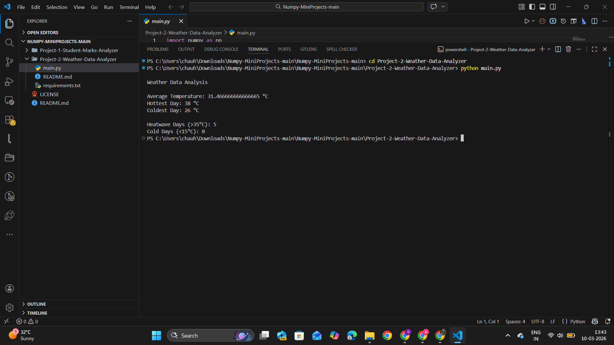

# Weather Data Analyzer (NumPy)

This project analyzes daily temperature data using NumPy.

Features:

* Average monthly temperature
* Hottest and coldest day detection
* Heatwave detection
* Cold day detection

Tech Stack:
Python
NumPy

